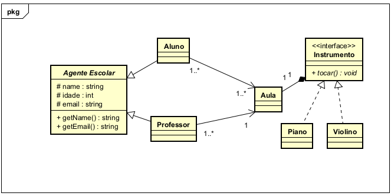

# 🎵 Sistema de Gerenciamento de Escola de Música

Este projeto tem como objetivo aplicar os princípios da **Programação Orientada a Objetos (POO)** por meio da **modelagem e implementação** de um sistema fictício de uma escola de música.

## 🎯 Objetivo da Atividade

Modelar e codificar um sistema que representa os principais elementos de uma escola de música, utilizando os conceitos fundamentais da POO em Java:

- Encapsulamento
- Herança
- Polimorfismo
- Abstração
- Associação com multiplicidade

## 📐 Modelagem

A modelagem foi realizada por meio de um **diagrama de classes UML**, que define as seguintes entidades e suas relações:

### 🧱 Entidades

- **Agente Escolar (superclasse)**
    - Atributos protegidos: `name`, `idade`, `email`
    - Métodos públicos: `getName()`, `getEmail()`

- **Aluno** *(herda de Agente Escolar)*
- **Professor** *(herda de Agente Escolar)*

- **Aula**
    - Relacionamentos:
        - 1..* Alunos
        - 1..* Professores
        - 1 Instrumento

- **Instrumento (Interface)**
    - Método: `tocar(): void`

- **Piano** *(implementa Instrumento)*
- **Violino** *(implementa Instrumento)*

## 🔄 Relações

- `Aluno` e `Professor` são especializações de `Agente Escolar`.
- Uma `Aula` envolve vários alunos e professores, e utiliza um instrumento musical.
- `Instrumento` é uma **interface**, permitindo a implementação polimórfica por diferentes tipos de instrumentos (ex: `Piano`, `Violino`).

## 💡 Princípios de POO Aplicados

| Conceito        | Aplicação no Projeto                                         |
|----------------|--------------------------------------------------------------|
| Encapsulamento | Atributos protegidos e acesso por métodos (`getters`)       |
| Herança        | `Aluno` e `Professor` herdam de `Agente Escolar`             |
| Polimorfismo   | Interface `Instrumento`, usada pela classe `Aula`            |
| Abstração      | Definição genérica de `Instrumento`                          |
| Associação     | Relações entre `Aluno`, `Professor`, `Aula`, `Instrumento`   |
| Multiplicidade | Definida no diagrama: 1..*, 1                                 |

## 💻 Linguagem e Ferramentas

- Linguagem: Java
- Ferramenta de modelagem: UML (Diagrama de Classes)
- IDE recomendada: IntelliJ IDEA / Eclipse

---

Desenvolvido como parte de uma atividade prática para consolidar o aprendizado de POO com Java.
