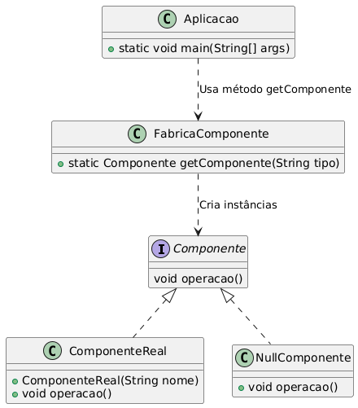

# 🧱 Null Object Pattern

O **Null Object Pattern** é um padrão de design comportamental que **evita verificações de null** no código ao fornecer um **objeto substituto** que representa a ausência de um valor.  
Em vez de retornar `null` e exigir que o código cliente verifique essa condição, o padrão usa um **objeto que implementa a mesma interface**, mas **sem efeitos colaterais**.




---

## 🛠 Por que usar o Null Object Pattern?

- ✅ **Evita verificações de null**: Reduz a necessidade de condicionais (`if (obj != null)`).
- ✅ **Melhora a legibilidade**: Código mais limpo e direto.
- ✅ **Evita exceções**: Minimiza erros como `NullPointerException`.

---

## 🔹 Exemplo em Java

Imagine um sistema que lida com usuários. Em vez de retornar `null` quando um usuário não é encontrado, podemos retornar um `NullUsuario`.

```java
// Interface comum
interface Usuario {
    void exibirInformacoes();
}

// Implementação real
class UsuarioReal implements Usuario {
    private String nome;

    public UsuarioReal(String nome) {
        this.nome = nome;
    }

    @Override
    public void exibirInformacoes() {
        System.out.println("Usuário: " + nome);
    }
}

// Implementação do Null Object
class NullUsuario implements Usuario {
    @Override
    public void exibirInformacoes() {
        System.out.println("Usuário não encontrado.");
    }
}

// Método que retorna um usuário
class UsuarioFactory {
    public static Usuario getUsuario(String nome) {
        if (nome.equalsIgnoreCase("Flavio")) {
            return new UsuarioReal(nome);
        } else {
            return new NullUsuario();
        }
    }
}

// Uso do padrão
public class Main {
    public static void main(String[] args) {
        Usuario usuario1 = UsuarioFactory.getUsuario("Flavio");
        Usuario usuario2 = UsuarioFactory.getUsuario("Desconhecido");

        usuario1.exibirInformacoes(); // Saída: Usuário: Flavio
        usuario2.exibirInformacoes(); // Saída: Usuário não encontrado.
    }
}
```

---

## ✅ Vantagens

- 🚫 Evita exceções ao acessar métodos de objetos inexistentes.
- 💪 Código mais robusto e menos propenso a erros.
- 🧪 Facilita testes, pois o Null Object pode atuar como um **stub**.

---


