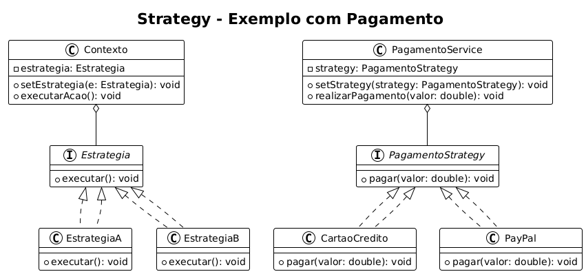

# 🏗️ Strategy: O Primeiro Padrão!

O Strategy é um **padrão de projeto** que deve ser utilizado quando uma classe possuir diversos algoritmos que possam ser aplicados de forma intercambiável.

A solução proposta pelo padrão consiste em **delegar a execução do algoritmo para uma instância** que compõe a classe principal. Dessa forma, quando a funcionalidade for invocada, o método da instância que a compõe será chamado dinamicamente.

## 📌 Exemplo

---

## 📖 Explicação detalhada

### ✔ Quando utilizar o Strategy?

Use o Strategy **quando uma classe possui diversos algoritmos possíveis** para realizar uma tarefa. Em vez de inserir múltiplas estruturas condicionais (`if`, `switch`, etc.), a responsabilidade pela lógica é delegada para outra classe.

### ✔ Como funciona?

O **Contexto** contém uma referência para uma interface de estratégia. Essa interface define um método comum (como `executar()`), implementado por diferentes classes, cada uma representando um algoritmo específico.

Dessa forma, a classe principal **não precisa saber qual algoritmo está sendo usado** — ela simplesmente delega a execução para a estratégia configurada!

---

## ✅ Benefícios do Strategy:

- **Flexibilidade**: novos algoritmos podem ser adicionados sem modificar a classe principal.
- **Código mais limpo**: reduz o uso de condicionais (`if-else`, `switch`).
- **Troca dinâmica**: o algoritmo pode ser alterado em tempo de execução.

## ❌ Possíveis desvantagens:

- **Complexidade**: exige instanciar e configurar corretamente o algoritmo desejado.
- **Gerenciamento**: pode aumentar o número de classes no sistema.
- **Cuidados com `null`**: uma estratégia mal atribuída pode causar erros em tempo de execução.

---
